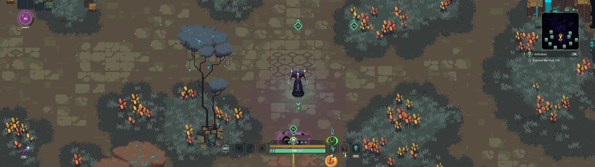

## Undungeon ultrawide and wider

The tool forces the game to support your resolution, which is useful for removing the side black bars at 21:9 and wider. Although any resolution is supported, the UI and camera placement may be undesirable at 48:9.

The gameplay view expands horizontally, however, the seemingly rare and short cutscenes will be cropped.

1. [Download](/../../releases) and unpack the archive.
2. Launch the game first, followed by the tool.
3. Press the hotkey and select any in-game resolution if necessary.

All trainers based on CE components may trigger some anti-virus software.

Tested on the latest Microsoft Store version at 2560x1080, 3840x1080, and 5760x1080.

You can buy me a [coffee](https://ko-fi.com/rozziroxx) or become a [patron](https://www.patreon.com/rozzi).

